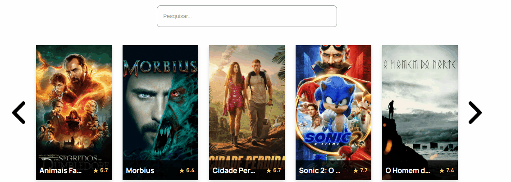
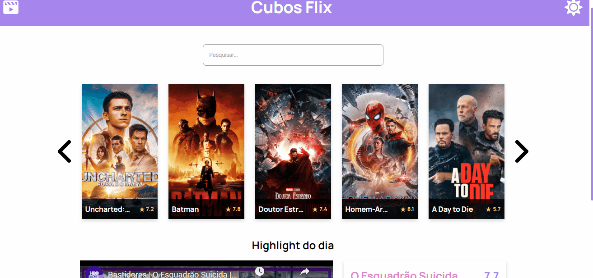

# CuboFlix

<h2>Sobre</h2>

Desafio proposto no módulo 2 da Cubos Academy. Uma plataforma de filmes que consome a API <a href="https://www.themoviedb.org/documentation/api">The MovieDB</a>.

Link para teste: <a href="https://cuboflix.netlify.app/">CuboFlix</a>

<h2>Características</h2>

<h3>Carrosel e imput para pesquisar sobre filmes.</h3>

<h3>Modal com informações do filme.</h3>

<h3>Filme do dia.</h3>

<h3>Modo Claro e Noturno, salvando a preferência no LocalStorage.</h3>

